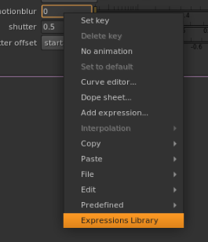

# Expressions Library

## Disclaimer

The following version was tested on Nuke 12v2.3.

Tests made on Nuke 11 were unsuccessful and resulted in segmentation faults.

## Quick Start

Copy the repo in a folder that will be recognised by your `NUKEPATH` (check within your `init.py`)

Inside your `menu.py`, add the following command:

```
nuke.menu('Animation').addCommand('Expressions Library', 'from expressions_library.dialog import ExpressionsLibraryWidget;el_widget = ExpressionsLibraryWidget();el_widget.show()')
```
And you should be all set to go.

## Instructions

Make a right click on a knob inside Nuke, and when the context menu opens you should see the following option:



Click on it and a dialog will pop up, divided in four main categories for all saved TCL expressions.

## Update:

Now featuring the following functionalities:
* Search bar
* Dynamic form for each expression