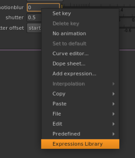

# Expressions Library

## Disclaimer

The following version was tested on Nuke 12v2.3.

Tests made on Nuke 11 were unsuccessful and resulted in segmentation faults.

## Quick Start

Copy the repo in a folder that will be recognised by your `NUKEPATH` (check within your `init.py`)

Inside your `menu.py`, add the following command:

```
nuke.menu('Animation').addCommand('Expressions Library', 'from expressions_library.dialog import ExpressionsLibraryWidget;el_widget = ExpressionsLibraryWidget();el_widget.show()')
```
And you should be all set to go.

## Instructions

Make a right click on a knob inside Nuke, and when the context menu opens you should see the following option:



Click on it and a dialog will pop up, divided in four main categories for all saved TCL expressions.


For each expression, you should find a description, a fields form if the expression receives arguments, and a Generate Button.


If the expression targets a Knob or a Node within Nuke, the usual text form will be traded for two dropdown menus, one listing all Nodes in the current script, the other listing all Knobs for the Node selected in the previous menu.


The Waves category is a bit of an outlier:
as depicted in the screenshot, the text description has been swaped for an illustration of the type of animation curve produced by the expression.


Finally the Search Bar on top of the dialog will filter all expressions to find only the ones which descriptions or formulas match the terms typed.
